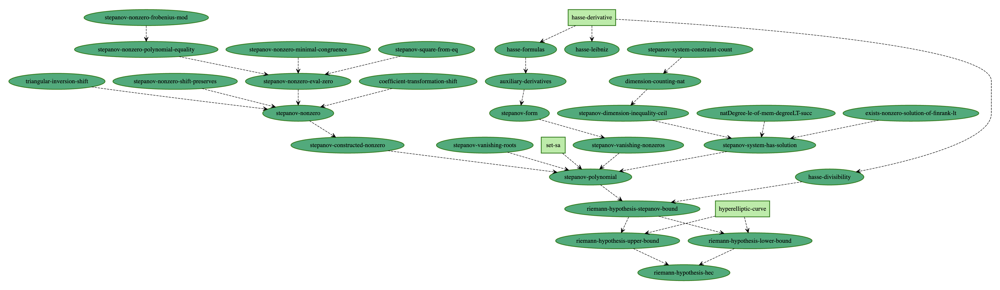

# The Riemann Hypothesis for curves, autoformalized

This is a formal Lean proof of the Riemann Hypothesis for hyperelliptic curves over finite fields. We follow the argument laid out in Chapter 11 of Iwaniec-Kowalski's classic text *Analytic Number Theory*, based on the Bombieri-Stepanov polynomial method.

Given a polynomial $f(x)$ of degree $m > 2$, let $F=\mathbb{F}_q$ be the finite field for the prime power $q > 6m$. Then the number of solutions to $y^2 = f(x)$ for $(x,y) \in F^2$ is bounded from the expected value of $q$ by at most $5m q^{1/2}$. This square-root cancellation is the analogue of the celebrated Riemann Hypothesis, for counting points on the hyperelliptic curve $y^2 = f(x)$.

The final Lean output is in `RiemannHypothesisHEC.lean`. The human-supplied blueprint is in `content.tex`.

All statements, proofs, and documentation were created by Gauss, Math Inc's frontier autoformalization agent.



---

## Highlights

- **Scope:** ≈2900 lines of Lean.
- **Workflow:** AI-generated formalization from a LaTeX blueprint with human scaffolding.
- **Result:** a complete Lean theorem establishing the Riemann Hypothesis for hyperelliptic curves over finite fields.

---

## Refactor progress (LOC by commit)

LOC is computed as the total number of lines across all git-tracked files at each commit (including comments/blank lines).

| Commit | Date | Message | LOC before | LOC after | Δ |
|---|---|---|---:|---:|---:|
| `c99880d` | 2026-01-16 | let there be light | — | 6813 | +6813 |
| `2993dab` | 2026-02-05 | Refactor: simplify StepanovSystem bounds | 6813 | 6776 | -37 |
| `fb5582a` | 2026-02-05 | Refactor: tighten dimension_inequality_nat setup | 6776 | 6766 | -10 |
| `c845f82` | 2026-02-05 | Refactor: compress constraint term bound | 6766 | 6756 | -10 |
| `c45445c` | 2026-02-05 | Refactor: simplify Bmax comparison algebra | 6756 | 6736 | -20 |
| `145e999` | 2026-02-05 | Refactor: use ker_ne_bot_of_finrank_lt | 6736 | 6728 | -8 |
| `86e39a9` | 2026-02-05 | Refactor: simplify m<q derivations | 6728 | 6721 | -7 |
| `9c63e29` | 2026-02-05 | Refactor: use LinearMap.mulRight for polyMulRightLinear | 6721 | 6715 | -6 |
| `3ff5e35` | 2026-02-05 | Refactor: use LinearMap.proj for piProj | 6715 | 6713 | -2 |

To regenerate this table locally:

```bash
python3 - <<'PY'
import subprocess

def sh(*args):
    return subprocess.check_output(args, text=True)

def loc_for_commit(commit: str) -> int:
    files = subprocess.check_output(['git', 'ls-tree', '-r', '--name-only', commit], text=True).splitlines()
    total = 0
    for f in files:
        content = subprocess.check_output(['git', 'cat-file', '-p', f'{commit}:{f}'])
        total += content.count(b'\n')
        if content and not content.endswith(b'\n'):
            total += 1
    return total

commits = sh('git', 'rev-list', '--reverse', '--first-parent', 'HEAD').splitlines()
rows = []
prev_loc = 0
for i, c in enumerate(commits):
    loc = loc_for_commit(c)
    before = None if i == 0 else prev_loc
    delta = loc if before is None else loc - before
    date = sh('git', 'show', '-s', '--format=%cs', c).strip()
    subj = sh('git', 'show', '-s', '--format=%s', c).strip()
    rows.append((c[:7], date, subj, before, loc, delta))
    prev_loc = loc

print('| Commit | Date | Message | LOC before | LOC after | Δ |')
print('|---|---|---|---:|---:|---:|')
for h, d, m, b, a, delta in rows:
    btxt = '—' if b is None else str(b)
    print(f'| `{h}` | {d} | {m} | {btxt} | {a} | {delta:+d} |')
PY
```

## Links

- **Math Inc.:** <https://www.math.inc/>
- **Gauss (autoformalization agent):** <https://www.math.inc/gauss>

---

## Repository layout

- `RiemannHypothesisCurves/` – main Lean development of the proof.
- `RiemannHypothesisCurves.lean` – top-level Lean entry point.
- `blueprint/` – LaTeX blueprint, including the dependency graph and web/PDF build assets.
- `home_page/` – Jekyll-based landing page used for the project website.

---

## Building

You will need:

- [Lean 4](https://lean-lang.org/) with `lake`
- [uv](https://docs.astral.sh/uv/getting-started/installation/) for the
  blueprint tools
- A LaTeX installation (e.g. TeX Live) for the PDF

### Lean development

```bash
lake exe cache get && lake build
```

### Blueprint (PDF)

```bash
uvx leanblueprint pdf
```

### Blueprint (web + local server)

```bash
uvx leanblueprint web
uvx leanblueprint serve
```

The generated site is served locally; by default the blueprint index is at
`http://localhost:8000/`.

---

## About

This repository is part of Math Inc.'s broader effort to apply AI-assisted
formal verification to fundamental problems in mathematics. Faster, lower-friction formalization can make complex mathematical
results easier to verify, extend, and trust.

For questions or collaborations, please reach out via
<https://www.math.inc/>.

---

## References

- Iwaniec, H., Kowalski, E., *Analytic Number Theory*, American Mathematical Society Colloquium Publications, vol. 53, 2004.
  <https://www.ams.org/books/coll/053/>
